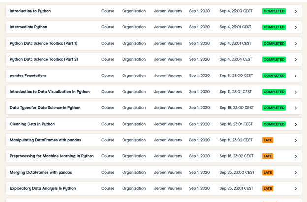

# Personal Portfolio
Dit is de Portfolio van de minor Applied Data Science van Levy Duivenvoorden (18005152).
Teamleden: Niels (Nelis), Niels, Amin en Jefry.

# Project definition
We are team Zero and we work with our problem owner, mr. Rahola.
The task that was given is to see if it is possible to predict the electricity production and consumption one day in advance on hourly resolution.
## onderzoeksvraag
The more specific research question is: 
What is a suitable machine learning model to predict energy use & production of a “zero at the meter” residential house, one day in advance with (if possible) an hourly resolution?
## literature review
The literature that has been read was.
What was the conclusion per paper, and was it beneficial.
### Data preprocessing
How was the data being processed?
### chosen models
According to the literature review the following models were chosen. 
The configuration of this model was: 
The model was trained. 
The model was evaluated. 
The outcome was visualized.
 
**CONSUMPTION**

MVLR

 
The consumption MVLR.

SVR

 
This is how you dropdown.

NN (MLP)

 
This is how you dropdown.

LSTM

 
This is how you dropdown.

¬

**PRODUCTION**

MVLR

 
This is how you dropdown.

SVR

 
This is how you dropdown.

NN (MLP)

 
This is how you dropdown.

LSTM

 
This is how you dropdown.

## conclusion
The conclusion is...

# written code (notebooks)
The code that has been written will be here.
Only the general purpose of the notebook.
## DataCamp exercizes
Below are the mendatory DataCamp Courses:¬

¬

The Extra DataCamp courses me (and the other Teammembers) did:
- Time Series Analysis in Python
- Visualizing Time Series Data in Python
- Manipulating Time Series Data in Python
- ARIMA Models in Python
- Machine Learning for Time Series Data in Python
## learned functions
All the learned methods in data science will be here.
With respect to the written code.

# Group effort
## Feature selection
What features were selected?
## General overview
The general plan will be stated here.
### planning
Every week we came together to make an sprint planning for the next week.
## presentations
Which presentations did I give?
## reflections
What did I learn this minor...

# Terminalogical (complex jargon)

TO DO:
- check links. .
- Make as short and specific as possible. .
- check if the big picture is clear. .
- Relation between the lectures and presentations and the problem. .
- clear contribution per team member of each notebooks. .
